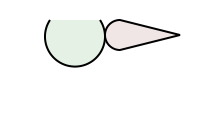

# Solver Shootout

This is a support repo for [just-solve](https://github.com/akauppi/just-solve), for comparing geometric constraints solvers, and picking one suitable for that project.

## Shopping list 🛍

The solver should:

- should be usable from JavaScript (in browser)
- handle the following geometries:
  - point, line, arc, circle, ellipse, spline (preferably)

- have the following constraints (some of which are relations to each other):

   ||constraint|
   |---|---|
   |point|x, y|
   |line|start, end, mid, angle|
   |arc|center, r, start-angle, end-angle, startP, endP|

## Sample case

The same sample case as with `just-solve`:

**Parts**

- arc green
  - start: 50,20
  - end: 100,20
  - r: 30
  - start-angle: 56.3

- arc pink
  - start: 120,50
  - end: 120,20
  - r: 15
  - start-angle: 180

- line pink 1
  - start: 120,50
  - end: 180,65

>The last line is not needed to be defined, since SVG `z` takes care of it.

**Constraints**

- arc green is fixed
- arc pink `.mid` is on arc green (also meaning it won't travel past its start/end points)
- line from arc pink `.mid` to line pink `.end` is perpendicular to arc green
- arc pink start and end points are symmetrical over the line from arc pink `.mid` to line pink `.end`
- arc pink r is fixed
- line length of arc pink `.mid` to line pink `.end` is fixed

That should have it so that the "cone" can move (if dragged) around the green arc, but is always pointing away from it and all the visual sizes remain unchanged.

## Candidates

